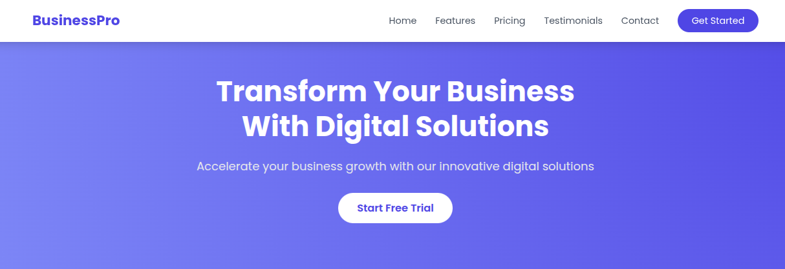

# BusinessPro - Business Website Template

A modern, responsive website template designed for businesses, startups, and SaaS companies. Featuring a clean design and interactive elements powered by Tailwind CSS and JavaScript.

## 📸 Template Preview


---

## ✨ Features

### 📱 Responsive Design
- Optimized for all screen sizes — mobile, tablet, and desktop

### ⚙️ Interactive Components
- Mobile-friendly navigation menu  
- Smooth scroll navigation  
- Scroll-triggered animations  
- Pricing toggle (monthly/annual)

### 🧩 Complete Business Sections
- Hero section with call-to-action  
- Feature highlights  
- Pricing plans  
- Client testimonials  
- Team member profiles  
- Contact form with Google Maps  
- Newsletter subscription form

### 🛠 Modern Tech Stack
- Tailwind CSS for styling  
- Responsive grid-based layouts  
- Inline SVG icons and vector graphics  
- Google Fonts integration (Poppins)

---

## 🚀 Installation

1. **Clone the repository**:
```bash
git clone https://github.com/yourusername/businesspro-template.git
````

2. **Open in browser**:

```bash
cd businesspro-template
open index.html
```

---

## 🎨 Customization

### 1. Update Brand Colors

Modify the gradient in the `<style>` section:

```css
.hero-bg {
  background-image: radial-gradient(circle at top right, #YourColor 0%, #YourColor 100%);
}
```

### 2. Change Content

Edit the content directly in the HTML files:

* Update text and headings
* Replace placeholder images in the `/images` directory
* Customize pricing, features, testimonials, etc.

### 3. Configure Contact Form

Replace Google Maps iframe with your business location:

```html
<iframe src="YOUR_GOOGLE_MAPS_EMBED_URL"></iframe>
```

Update contact info:

```html
<p>123 Business Street<br>New York, NY 10001</p>
<a href="tel:+11234567890">+1 (123) 456-7890</a>
```

---

## 📦 Dependencies

* [Tailwind CSS](https://tailwindcss.com/) (via CDN)
* [Google Fonts - Poppins](https://fonts.google.com/specimen/Poppins)
* Font Awesome Icons (as embedded SVGs)

---

## 📜 Scripts Overview

### Mobile Navigation

```javascript
const mobileMenuButton = document.getElementById('mobile-menu-button');
const mobileMenu = document.getElementById('mobile-menu');

mobileMenuButton.addEventListener('click', () => {
    mobileMenu.classList.toggle('hidden');
});
```

### Smooth Scroll

```javascript
document.querySelectorAll('a[href^="#"]').forEach(anchor => {
    anchor.addEventListener('click', function (e) {
        e.preventDefault();
        const target = document.querySelector(this.getAttribute('href'));
        target.scrollIntoView({ behavior: 'smooth', block: 'start' });
    });
});
```

### Scroll Animations

```javascript
const observer = new IntersectionObserver((entries) => {
    entries.forEach(entry => {
        if (entry.isIntersecting) {
            entry.target.classList.add('opacity-100');
            entry.target.classList.remove('opacity-0');
        }
    });
});
```

---

## 🤝 Contributing

Contributions are welcome!
To contribute:

1. Fork the project
2. Create your feature branch:

```bash
git checkout -b feature/AmazingFeature
```

3. Commit your changes:

```bash
git commit -m 'Add some AmazingFeature'
```

4. Push to your branch:

```bash
git push origin feature/AmazingFeature
```

5. Open a Pull Request

---

## 📝 License

Distributed under the MIT License. See `LICENSE` file for details.

```

---

Let me know if you'd like this in a downloadable `.md` file or to include a live demo badge or project screenshot section.
```
